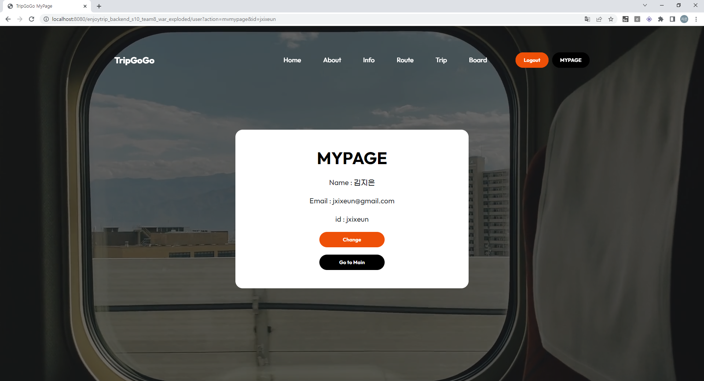

# :airplane: TripGoGo
전국의 음식점, 카페, 관광정보를 한눈에 볼 수 있는 여행 사이트

 

# :bust_in_silhouette: Made by
- 서울 10반 김지은
- 서울 10반 정지원
 

# :clipboard: 주요 기능
<h5> :loudspeaker: 기본 기능</h5>   

1. Main Page  

2. 카테고리 별 관광지 조회(관광지 정보 조회)  

3. 회원 관리 페이지  

4. 로그인 / 로그아웃 페이지    

<h5> :loudspeaker: 추가 기능</h5>  

1. MyTrip(나만의 여행 계획 페이지)  

2. 여행 정보 공유 게시판  

3. 대중교통 길 찾기  

 

# :memo: 웹 페이지
### Main Page
- Main Page

  

### 회원 관리 페이지
- 회원 정보를 확인 할 수 있는 페이지

  

### 로그인 페이지
- 로그인 페이지

  

### 회원가입 페이지
- 회원 가입을 할 수 있는 페이지

  

### 회원가입 예외처리
- 중복회원 가입 불가

- 아이디 길이 제한

- 비밀번호 제한

- 비밀번호와 비밀번호 확인 필드 일치 검사

### 회원 관리 페이지
- 회원 정보를 수정할 수 있는 페이지

  

- 수정 후 변경된 회원 정보 

  

### 비밀번호 찾기
- 비밀번호를 찾을 수 있는 기능으로 회원가입 시 입력한 질문과 그에 해당하는 답변을 가지고 비밀번호를 찾을 수 있다.

  

- 비밀번호 변경 후

  

### Route
- 출발지부터 목적지까지 경로 확인 가능
 

- 출발지부터 목적지의 마커와 직선거리 표시
 

- 출발지부터 목적지까지 대중교통 길찾기 결과 제공
 

 

### 게시판
- 여행 후기 게시판  
 

 

#### 게시글 화면
- 게시글의 수정, 삭제가 가능하다.
 

 

#### 게시글 작성
 

#### 게시글 수정
 

### Mytrip

- 날짜별로 여행 계획을 짤 수 있다.

#### 여행 계획 리스트

- 여행 계획 리스트를 볼 수 있다.

 

#### 여행 계획 생성

- 여행 계획을 생성 할 수 있다.

 
 
 

#### 여행 계획 생성 예외처리

- 도시 미선택시 경고 알림
 

- 여행 시작일 미선택시 경고 알림
 

- 여행 종료일 미선택시 경고 알림
 

- 여행 종료일이 시작일보다 먼저인 경우 경고 알림
 

- 여행 생성 후 화면
 
 

#### 선택 화면

- 방문할 장소 검색 후 선택

 
 
 

 

- 방문할 장소 선택 후 화면

 
 

- 추가된 장소 삭제 가능

 
 

#### 여행 계획 뷰

- 날짜별 여행 계획을 볼 수 있다.

 

# DB 

  

# Class Diagram

# :mag_right: 사용 데이터
- TMAP API [https://tmapapi.sktelecom.com]
- Kakao Map API [https://apis.map.kakao.com]
 

# :computer: 개발언어/프로그램
- HTML / CSS / JavaScript / VS Code
- Servelt JSP / Java
